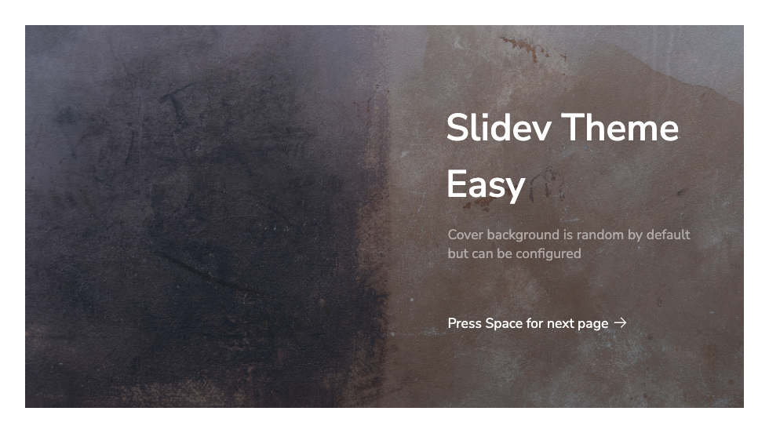
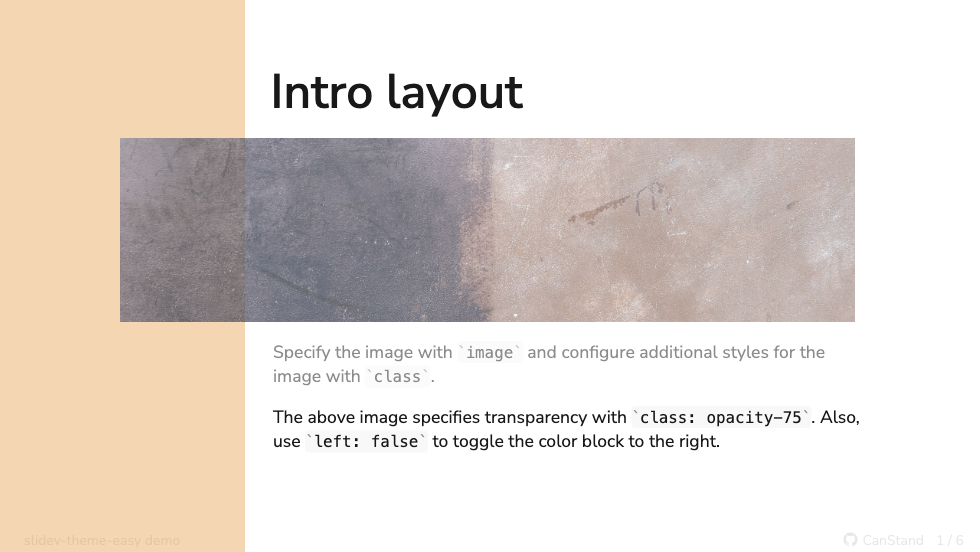
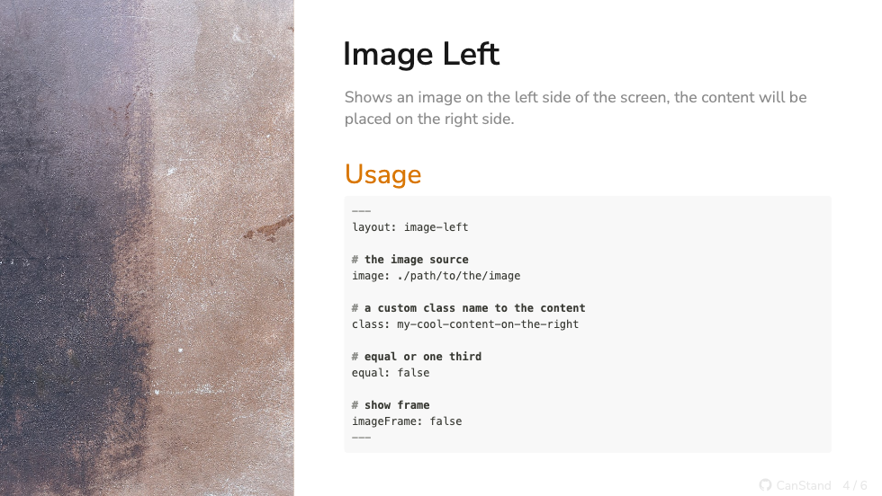
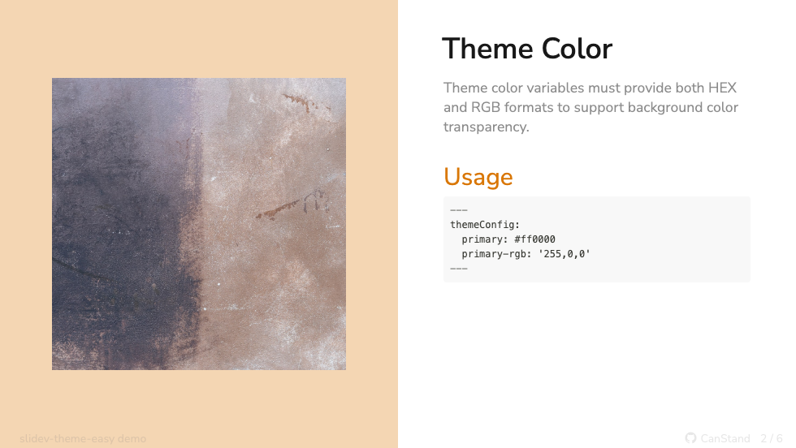
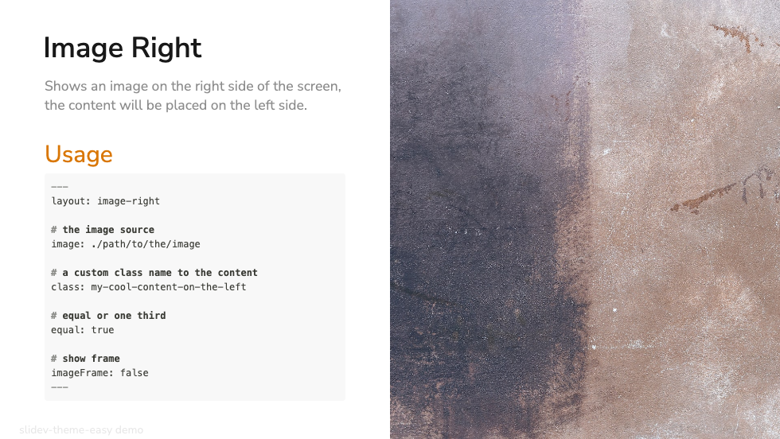
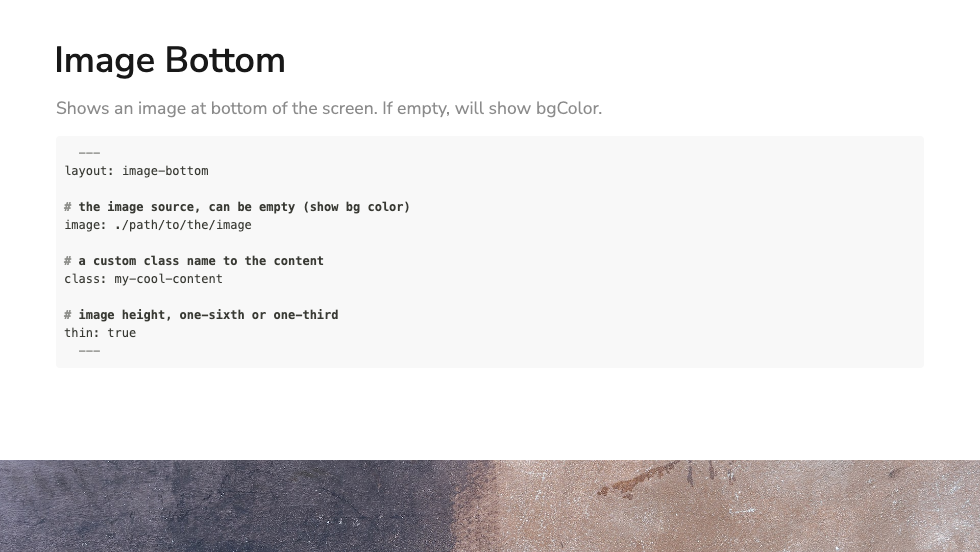

# slidev-theme-easy

[](https://www.npmjs.com/package/slidev-theme-easy)

A simple theme for [Slidev](https://github.com/slidevjs/slidev).

Live demo: [...]

> TODO:

## Install

Add the following frontmatter to your `slides.md`. Start Slidev then it will prompt you to install the theme automatically.

<pre><code>---
theme: <b>easy</b>
---</code></pre>

Learn more about [how to use a theme](https://sli.dev/themes/use).

## Layouts

This theme provides the following layouts:

> TODO:

### Cover

Usage:
```md
layout: cover
background: 'https://source.unsplash.com/collection/94734566/1920x1080'
```


### Intro
Usage:
```md
layout: intro
image: 'https://source.unsplash.com/collection/94734566/1920x1080'
class: opacity-75
# use `left: false` to toggle the color block to the right
left: true

```


### Image-Left

Usage:
```md
layout: image-left

# the image source
image: ./path/to/the/image

# a custom class name to the content
class: my-cool-content-on-the-right

# equal or one third
equal: false

# show frame
imageFrame: false
```


```md
layout: image-left
equal: true
imageFrame: true
```


### Image-Right

Usage:
```md
layout: image-right

# the image source
image: ./path/to/the/image

# a custom class name to the content
class: my-cool-content-on-the-left

# equal or one third
equal: true

# show frame
imageFrame: false
```


### Image-Bottom

Usage:
```md
layout: image-bottom

# the image source, can be empty (show bg color)
image: ./path/to/the/image

# a custom class name to the content
class: my-cool-content

# image height, one-sixth or one-third
thin: true
```


## Components

This theme provides the following components:

> TODO:

## Contributing

- `npm install`
- `npm run dev` to start theme preview of `example.md`
- Edit the `example.md` and style to see the changes
- `npm run export` to generate the preview PDF
- `npm run screenshot` to generate the preview PNG
